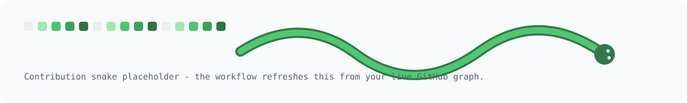
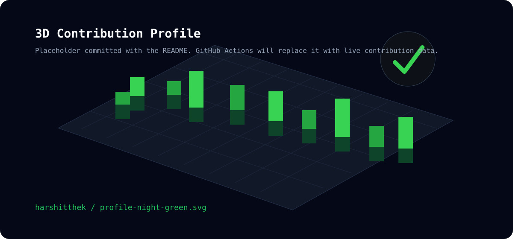

<div align="center">


<br />

<a href="https://github.com/harshitthek">
  
</a>

<p>
  <strong>AI & ML student at USAR (GGSIPU) building practical web, ML, and systems projects.</strong>
  <br />
  I like turning rough ideas into working products, testing how systems fail, and learning by shipping.
</p>

<p>
  <a href="mailto:codewithharshitsharma@gmail.com"></a>
  <a href="https://www.linkedin.com/in/devharshitsharma"></a>
  <a href="https://x.com/NotYourHarshit"></a>
  <a href="https://dev.to/harshitthek"></a>
  <a href="https://gitlab.com/harshitthek"></a>
  
</p>

<p>
  
  
</p>

</div>

---

```ts
const harshit = {
  basedIn: "New Delhi, India",
  focus: ["AI/ML", "full-stack web", "backend APIs", "cybersecurity"],
  building: ["ML-backed products", "privacy-first web tools", "Linux/security labs"],
  learning: ["DSA", "FastAPI auth", "model deployment", "system design basics"],
  openTo: ["internships", "open source", "web/backend collaborations"],
};
```

### Currently in the Lab

- Training ML models and wrapping them in real APIs and dashboards.
- Building full-stack apps with React, FastAPI, databases, auth, and deployment pipelines.
- Exploring Linux, security basics, failure recovery, and the internals behind everyday tools.
- Looking for internships, beginner-friendly open-source work, and practical product ideas to build with others.

### Featured Builds

<table>
  <tr>
    <td width="50%">
      <h3><a href="https://github.com/harshitthek/used-bike-price">Used Bike Price Predictor</a></h3>
      <p>ML app for Indian used motorcycle resale pricing using cleaned Droom/Kaggle market data.</p>
      <p><strong>Proof:</strong> XGBoost reached R2 = 0.91 with FastAPI, React, CI, Docker, Render, and Vercel support.</p>
    </td>
    <td width="50%">
      <h3><a href="https://github.com/harshitthek/carbon-guardian-ai">Carbon Guardian AI</a></h3>
      <p>Full-stack carbon footprint reduction platform with user activity, recommendations, rewards, and community insights.</p>
      <p><strong>Stack:</strong> React, FastAPI, SQLite, TensorFlow Recommenders hook, weather/AQI providers.</p>
    </td>
  </tr>
  <tr>
    <td width="50%">
      <h3><a href="https://github.com/harshitthek/Customizable-Browser-Startpage">Customizable Browser Startpage</a></h3>
      <p>Privacy-first browser homepage with themes, bookmarks, search engines, GitHub widget, local storage, and import/export.</p>
      <p><strong>Focus:</strong> vanilla JavaScript, security hardening, CSP, XSS-safe rendering, and zero tracking.</p>
    </td>
    <td width="50%">
      <h3>Learning Lab</h3>
      <p>Small experiments around Linux, frontend polish, backend auth, DSA, and security concepts.</p>
      <p><strong>Goal:</strong> break things carefully, understand the internals, then rebuild them cleaner.</p>
    </td>
  </tr>
</table>

### Tech Stack & Tools

<div align="center">

**Languages**
<br />


**Frontend & App Building**
<br />


**Backend, Data & AI**
<br />


**DevOps & Workflow**
<br />


</div>

### GitHub Activity

<div align="center">


<br />


<br />


<br />


</div>

### Contribution Lab

<div align="center">

<picture>
  <source media="(prefers-color-scheme: dark)" srcset="./assets/snake/github-contribution-grid-snake-dark.svg" />
  <source media="(prefers-color-scheme: light)" srcset="./assets/snake/github-contribution-grid-snake.svg" />
  
</picture>

<br />



</div>

---

<div align="center">
  <strong>break systems - learn internals - build better software</strong>
</div>
