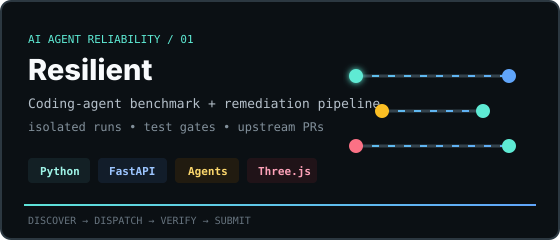
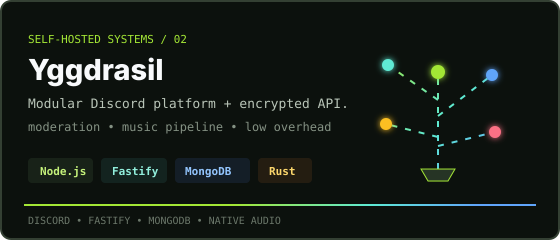
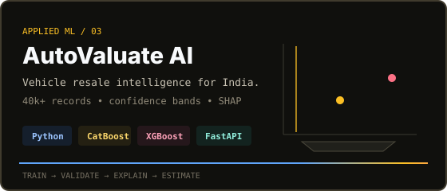
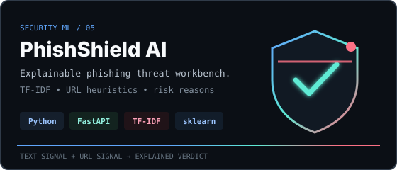

<div align="center">



<br />

<a href="https://github.com/harshitthek">
  
</a>

<p>
  <strong>AI &amp; ML student at USAR, GGSIPU building applied intelligence, reliable backend systems, and useful developer tools.</strong>
  <br />
  I move between model evaluation, APIs, Android, browser internals, and open-source maintenance - wherever the engineering gets interesting.
</p>

<p>
  <a href="https://harshitthek.is-a.dev" target="_blank" rel="noreferrer"></a>
  <a href="mailto:codewithharshitsharma@gmail.com" target="_blank" rel="noreferrer"></a>
  <a href="https://www.linkedin.com/in/devharshitsharma" target="_blank" rel="noreferrer"></a>
  <a href="https://github.com/harshitthek?tab=repositories" target="_blank" rel="noreferrer"></a>
</p>

</div>

---

```ts
const harshit = {
  basedIn: "New Delhi",
  focus: [
    "applied ML",
    "agent systems",
    "backend APIs",
    "open source",
  ],
  shipping: [
    "Resilient",
    "Yggdrasil",
  ],
  openTo: [
    "internships",
    "collaboration",
  ],
};
```

### Engineering Focus

- **Applied AI with measurable behavior:** model evaluation, spatial validation, recommenders, explainability, and ML-backed product APIs.
- **Systems that operate cleanly:** agent orchestration, self-hosted services, recovery paths, security boundaries, tests, and deployment automation.
- **Products people can inspect:** responsive interfaces, transparent metrics, local-first tools, browser extensions, and Android experiences.

### Flagship Builds

<div align="center">

<p>
<a href="https://github.com/harshitthek/resilient" target="_blank" rel="noreferrer"></a><a href="https://github.com/harshitthek/Yggdrasil" target="_blank" rel="noreferrer"></a>
</p>

<p>
<a href="https://github.com/harshitthek/used-bike-price" target="_blank" rel="noreferrer"></a><a href="https://github.com/harshitthek/Finvaria-App" target="_blank" rel="noreferrer"></a>
</p>

<p>
<a href="https://github.com/harshitthek/AI-Powered-Phishing-Detection" target="_blank" rel="noreferrer"></a><a href="https://github.com/harshitthek/harshitfolio" target="_blank" rel="noreferrer"></a>
</p>

</div>

### More Shipped

- [**AeroLens India**](https://github.com/harshitthek/aerolens-india) - Satellite and ground-station air-quality intelligence with spatial and temporal validation. `Python` `LightGBM` `PyTorch` `Streamlit`
- [**Carbon Guardian AI**](https://github.com/harshitthek/carbon-guardian-ai) - Explainable sustainability recommendations, simulations, rewards, and admin controls. `React` `FastAPI` `TensorFlow` `SQLAlchemy`
- [**ShieldBlock**](https://github.com/harshitthek/ShieldBlock) - Manifest V3 network filtering, cosmetic rules, element picking, and request logging. `JavaScript` `Chrome MV3` `DNR`
- [**Custom Browser Startpage**](https://github.com/harshitthek/Customizable-Browser-Startpage) - Privacy-first local dashboard with themes, search, bookmarks, and CSP controls. `JavaScript` `HTML` `CSS`
- [**LetterGuess**](https://github.com/harshitthek/LetterGuesingSim) - Offline deterministic candidate generation with plugins, constraints, and replay data. `Python` `PySide6` `SQLite`
- [**Customer Support Dispatcher**](https://github.com/harshitthek/Customer-Support-Ticket-Dispatcher-ML) - Multi-task BERT routing and urgency scoring in one inference pass. `TensorFlow` `BERT` `FastAPI` `Streamlit`

### Open Source Impact

- **6 merged PRs · [Soup](https://github.com/MakazhanAlpamys/Soup/pulls?q=is%3Apr+author%3Aharshitthek+is%3Amerged)** - Cross-platform model-path fixes, deterministic GPU benchmarks, ML recipe support, and anti-drift test invariants.
- **Merged · [Yggdrasil Systems](https://github.com/Yggdrasil-Systems/Yggdrasil-Bot/pull/1)** - Feature-flagged local YouTube extractor cutover with rollback paths and 325 passing tests.
- **Merged · [Customer Support Ticket Dispatcher](https://github.com/here-2007/Customer-Support-Ticket-Dispatcher/pull/1)** - Correctness fixes, model pipeline improvements, and project documentation.
- **In review · [Turbolist3r](https://github.com/fleetcaptain/Turbolist3r/pull/17)** - Python 3.13 modernization, repaired OSINT sources, compatibility tests, and failure-tolerant parsing.

### Repository-Backed Stack

<div align="center">

**Languages**
<br />


**Application &amp; Data Systems**
<br />


**ML, Platform &amp; Workflow**
<br />


<br />


</div>

### Open Source Signal Map

<div align="center">

<a href="https://github.com/harshitthek?tab=overview" target="_blank" rel="noreferrer">
  
</a>

</div>

### GitHub Activity

<div align="center">


<br />


</div>

<details>
<summary><strong>More GitHub metrics</strong></summary>

<div align="center">


<br />


</div>

</details>

<div align="center">

<sub>Profile views: </sub>

<br />
<br />

<strong>measure the system - find the failure - ship the fix</strong>

</div>
