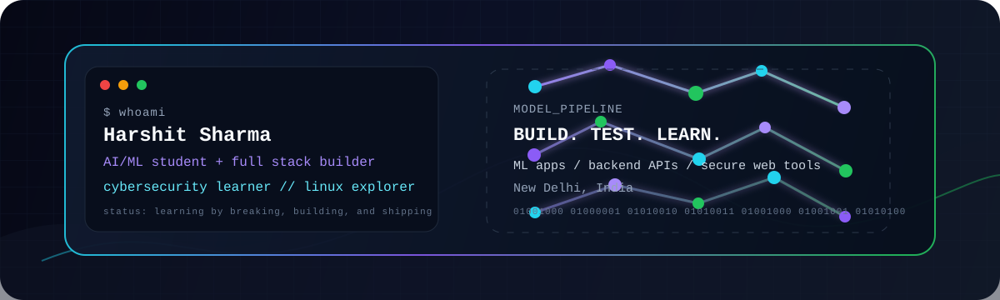
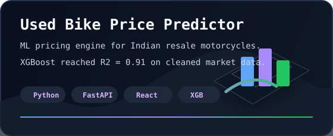
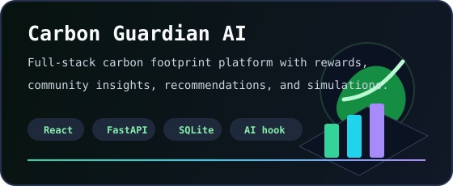
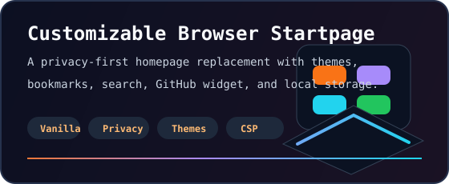
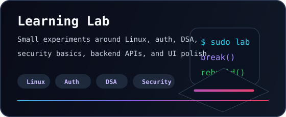

<div align="center">



<br />

<a href="https://github.com/harshitthek">
  
</a>

<p>
  <strong>AI & ML Engineering Student at USAR (GGSIPU) building autonomous AI systems, scalable backend APIs, and modern web applications.</strong>
  <br />
  I specialize in turning complex ideas into resilient products, probing system boundaries, and engineering production pipelines.
</p>

<p>
  <a href="mailto:codewithharshitsharma@gmail.com" target="_blank" rel="noreferrer"></a>
  <a href="https://www.linkedin.com/in/devharshitsharma" target="_blank" rel="noreferrer"></a>
  <a href="https://x.com/NotYourHarshit" target="_blank" rel="noreferrer"></a>
  <a href="https://dev.to/harshitthek" target="_blank" rel="noreferrer"></a>
  <a href="https://gitlab.com/harshitthek" target="_blank" rel="noreferrer"></a>
  <a href="https://discord.com/users/604653481999204360" target="_blank" rel="noreferrer"></a>
</p>

</div>

---

```ts
const harshit = {
  basedIn: "New Delhi, India 🇮🇳",
  focus: ["Autonomous AI Agents", "Full-Stack Web (React/Next.js)", "Backend APIs (FastAPI/Node)", "System Security"],
  flagshipProject: "harshitthek/resilient (Autonomous Open-Source AI Coding Benchmark & Pipeline)",
  building: ["AI Agent Orchestration Pipelines", "ML-backed Price Predictors", "3D Web Dashboards"],
  learning: ["Distributed Systems", "LLM Function Calling", "Advanced System Security"],
  openTo: ["AI/ML Internships", "Open Source Collaborations", "Full-Stack Engineering Projects"]
};
```

### 🚀 Flagship & Featured Builds

<div align="center">

<!-- Resilient Flagship Banner Card -->
<a href="https://github.com/harshitthek/resilient" target="_blank" rel="noreferrer">
  
</a>

<br /><br />

<p>
<a href="https://github.com/harshitthek/used-bike-price" target="_blank" rel="noreferrer"></a><a href="https://github.com/harshitthek/carbon-guardian-ai" target="_blank" rel="noreferrer"></a>
</p>

<p>
<a href="https://github.com/harshitthek/Customizable-Browser-Startpage" target="_blank" rel="noreferrer"></a><a href="https://github.com/harshitthek?tab=repositories" target="_blank" rel="noreferrer"></a>
</p>

</div>

### 🛠️ Tech Stack & Arsenal

<div align="center">

**Core Languages**
<br />


<br /><br />

**Frontend & 3D Interactive UI**
<br />


<br /><br />

**Backend, Data & AI Orchestration**
<br />


<br /><br />

**DevOps, CI/CD & Cloud**
<br />


</div>

---

### 📊 GitHub Activity & Analytics

<div align="center">


<br />


<br />


<br />


</div>

### 🌆 3D Contribution City

<div align="center">

<a href="https://gitcity.natrajx.in/harshitthek" target="_blank" rel="noreferrer">
  
</a>

<br />

<sub>Profile views: </sub>

</div>

---

<div align="center">
  <strong>break systems • probe boundaries • engineer resilient software</strong>
</div>
